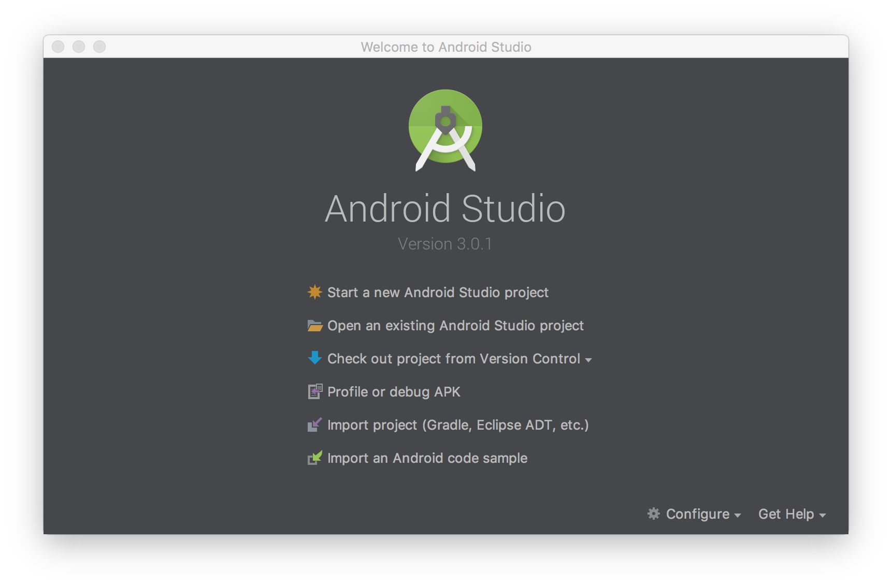

# Android Development Guide

## Supported Browser Targets

The goal is to have full coverage against all modern Android versions against all devices; however, we select a reasonable subset which we believe will have a high likelihood of full interoperability across modern devices.

The following Android versions are targetd.

* Android 6.0
* Android 7.1

## Development Setup Overview

To work on Slate with Android, we recommend using the official integrated develpment environment for Google's Android operating system which is available on Windows, Mac and Linux.

## Android Development on Mac

### Android Development on Windows and Linux

## Setup

### Warning: State of Android Studio

At time of writing, Android Studio does not _just work_ out of the box like a typical application. Expect to go through a process which can be difficult if you've never used Android Studio before; however, with this development guide you should be able to get through this process as quickly as possible.

### Download and Install Android Studio

Download and install Android Studio from here

[https://developer.android.com/studio/index.html](https://developer.android.com/studio/index.html)

Start downloading Android Studio by clicking the installation button on the web page. After clicking you will be redirected to an instruction page on how to **Install Android Studio**.

The instructions page contains both written instructions and a video. The short video is an excellent and succinct method for completing the installation process.

Note: We used the default installation.

### Notes:

* Is the "Include Android Instant App support" necessary or was just accidental?
* Make sure to include that they must download using the links in the error messages after starting
* Make sure they install HAXM

### Downloading Essentials

By default, the easiest way to ensure you have the essentials is to start an Android Studio project

### Windows and Linux Issues

Inside Android Studio, you are supposed to be able to use the menu to access **Tools** &gt; **Android** &gt; **AVD Manager** in order to manage virtual devices like Android phones or tablets as per these instructions here:

[https://developer.android.com/studio/run/managing-avds.html](https://developer.android.com/studio/run/managing-avds.html)

The AVD Manager may be missing.

The most common cause for this one Windows that I am aware of \(the author is a Mac user\) is that the Intel Hardware Accelerated Execution Manager \(HAXM\) is not installed.

Note: Android Studio **Preferences** may show that **Appearances & Behavior** &gt; **System Settings** &gt; **Intel x86 Emulator Accelrator \(HAXM installer\)** is marked as installed when in fact HAXM is not installed. This \(ambiguously\) indicates that the _installer_ is installed, not that HAXM itself is installed.

We recommend installing from the official Intel Download to be sure:

[https://software.intel.com/en-us/articles/intel-hardware-accelerated-execution-manager-intel-haxm](https://software.intel.com/en-us/articles/intel-hardware-accelerated-execution-manager-intel-haxm)

### Mac Issues

Inside Android Studio, you are supposed to be able to use the menu to access **Tools** &gt; **Android** &gt; **AVD Manager** in order to manage virtual devices like Android phones or tablets as per these instructions here:

[https://developer.android.com/studio/run/managing-avds.html](https://developer.android.com/studio/run/managing-avds.html)

The AVD Manager may be missing.

The solution is as follows:

1. Create a new project in Android Studio. The project itself is not important; however, it will give us access to the IDE which we will need to access these functions.
2. From the project, press `CTRL+SHIFT+A` on Windows/Linux or `CMD+SHIFT+A` on a Mac.
3. 
[https://stackoverflow.com/questions/47173708/why-avd-manager-options-are-not-showing-in-android-studio?rq=1](https://stackoverflow.com/questions/47173708/why-avd-manager-options-are-not-showing-in-android-studio?rq=1)

